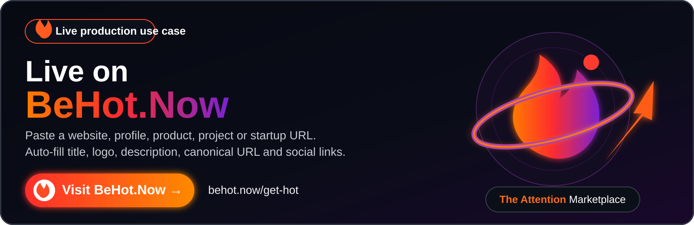
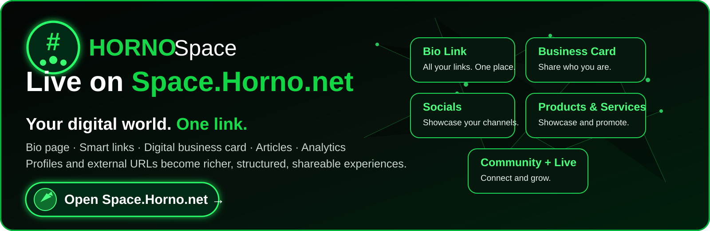
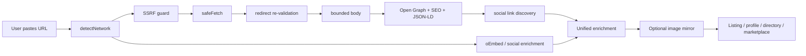
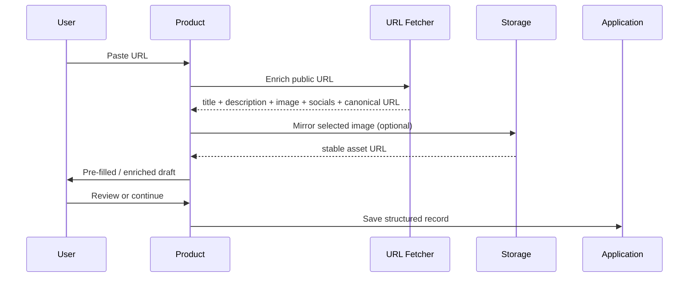

# URL Metadata & Social Profile Fetcher

[](CHANGELOG.md) [](https://www.typescriptlang.org/) [](https://nodejs.org/) [](package.json) [](LICENSE) [](https://github.com/vpicciuolo/url-metadata-social-fetcher/actions/workflows/ci.yml)

**Paste a public URL. Get structured metadata you can actually use.**

`url-metadata-social-fetcher` is a production-oriented TypeScript toolkit for **URL metadata extraction, Open Graph parsing, SEO metadata, social profile enrichment, link previews, URL unfurling, public social-link discovery, SSRF-safe server-side fetching and remote-image mirroring**.

It is designed for the moment a product asks a user to paste a website, creator profile, product, project, startup, app, song, marketplace listing or social URL. From that single input you can build a richer record containing a title/name, description/bio, canonical URL, preview image, favicon/avatar, social links, keywords, theme-color hints and available public profile metrics.

The core has **zero runtime dependencies** and uses standard Web APIs. Node.js 18+ is the primary supported runtime.

---

## 🔥 Live in production

This is not only a reference implementation. The same URL-enrichment approach is already used in live HRN Innovation products.

### BeHot.Now — The Attention Marketplace

<a href="https://behot.now/get-hot">
  
</a>

**[→ Open the live BeHot.Now listing flow](https://behot.now/get-hot)**

[BeHot.Now](https://behot.now) is an attention marketplace where creators, startups, apps, brands, products, businesses, events, services and ideas can compete for visibility on live ranking boards.

The URL fetcher powers the **URL-first listing workflow**: a user submits a website, product, project or profile URL and BeHot can use public metadata to pre-fill useful listing information such as the **name/title, description, logo or preview image, canonical URL and discovered social links**. The user can then review the draft before the listing enters the platform workflow.

That pattern is especially valuable for **Outbid-style websites, paid ranking boards, startup launch directories and discovery marketplaces** because users do not need to manually retype public information that already exists on the URL they submit.

**Live:** [behot.now](https://behot.now) · **Try the flow:** [behot.now/get-hot](https://behot.now/get-hot) · **How it works:** [behot.now/how-it-works](https://behot.now/how-it-works)

### HORNO Space — Your digital world. One link.

<p align="center">
  <a href="https://space.horno.net">
    
  </a>
</p>

<a href="https://space.horno.net">
  
</a>

**[→ Open HORNO Space](https://space.horno.net)**

[HORNO Space](https://space.horno.net) is an **all-in-one digital identity and sharing platform** for creators, professionals, founders, recruiters and communities. One public Space can bring together a bio page, smart links, social profiles, a digital business card, articles, products and services, referral links, QR sharing, analytics, verification, community discovery, live experiences and a public profile designed to be discoverable on the web.

The same URL-enrichment functionality is used live in HORNO Space to make external URLs and profile links more useful. Instead of treating a submitted URL as plain text, the system can read the public page, normalize the destination and obtain usable metadata for **richer link/profile cards, previews and profile-building workflows**.

Typical HORNO Space enrichment use cases include:

- adding a website and obtaining a usable title, description, canonical URL and visual preview;
- importing public social/profile information where the source exposes it;
- generating richer smart-link cards instead of displaying only a raw URL;
- discovering public social links connected to a website;
- using favicon, Open Graph image or available profile imagery in presentation layers;
- normalizing external links before they are added to a user's digital identity;
- reducing manual profile setup when a user already has public information elsewhere;
- producing structured metadata that can support search, previews, discovery and indexing.

**Live:** [space.horno.net](https://space.horno.net) · **HORNO Network:** [horno.net](https://horno.net)

---

## Why this exists

A URL field becomes infrastructure surprisingly quickly: redirects, expiring CDN images, inconsistent social metadata, Open Graph vs JSON-LD vs oEmbed, oversized responses, repeated requests and SSRF risk. This project packages a reusable engineering layer for those problems.

### v1.0.0.1 capabilities

| Capability | Included |
| --- | --- |
| URL safety | SSRF guard, private-network rejection, credentials/scheme/port validation |
| Redirect safety | Re-validation on every redirect hop |
| Resource limits | Whole-request timeout, streaming byte cap, redirect cap, content-type filtering |
| SEO metadata | title, description, canonical, author, date, locale, keywords, type |
| Social metadata | Open Graph, Twitter/X cards, JSON-LD, oEmbed |
| Social discovery | Public social/profile links found in anchors |
| Brand hints | theme/tile color metadata |
| Profile enrichment | name, bio, avatar, followers/subscribers/following/posts when publicly available |
| Networks | Instagram, Threads, Facebook, TikTok, YouTube, SoundCloud, Twitch, Spotify, X, GitHub, LinkedIn, Telegram, Pinterest, Snapchat, Discord |
| Images | OG/avatar/favicon discovery and optional mirroring |
| Cache | TTL memory cache + in-flight de-duplication |
| Storage | filesystem, generic HTTP PUT, memory |
| Runtime deps | 0 |

## Quick start — one API

```ts
import { enrichUrl } from 'url-metadata-social-fetcher';

const result = await enrichUrl('https://example.com');
console.log(result);
```

Typical website result:

```ts
{
  input: 'https://example.com',
  kind: 'website',
  network: 'website',
  canonicalUrl: 'https://example.com/',
  title: 'Example Domain',
  description: 'Example description',
  imageUrl: 'https://example.com/og.jpg',
  iconUrl: 'https://example.com/favicon.ico',
  themeColor: '#111111',
  brandColors: ['#111111'],
  keywords: ['example'],
  socialLinks: ['https://x.com/example']
}
```

Social profile:

```ts
const creator = await enrichUrl('https://www.instagram.com/nasa/');
console.log(creator?.kind);    // social-profile
console.log(creator?.network); // instagram
console.log(creator?.profile);
```

## Architecture



See [`docs/ARCHITECTURE.md`](docs/ARCHITECTURE.md).

## Production pattern: URL → usable product data

The common product workflow looks like this:



BeHot.Now uses this pattern for listing creation, while HORNO Space uses the same class of URL enrichment for richer external links and profile-oriented experiences.

## What can you build?

The library is deliberately generic. A public URL can be the starting point for many different products and internal tools.

### Ranking and discovery

- Outbid / bid-to-position websites
- paid visibility boards
- pay-to-rank leaderboards
- startup launch boards
- Product Hunt-style directories
- AI tool directories
- SaaS directories
- developer-tool directories
- creator charts
- influencer charts
- artist and music charts
- brand rankings
- app rankings
- product rankings
- sponsored resource lists
- community discovery boards
- trending pages
- launch aggregators

### Profiles and digital identity

- creator and influencer profiles
- artist, DJ and musician profiles
- founder profiles
- company profiles
- recruiter profiles
- portfolio builders
- personal landing pages
- link-in-bio platforms
- digital business cards
- claim-your-profile workflows
- social-profile import
- profile onboarding
- public member directories
- community identity pages
- speaker and talent profiles

### Marketplaces and services

- freelancer marketplaces
- creator marketplaces
- influencer campaign platforms
- agency directories
- vendor directories
- talent directories
- service/gig listings
- expert directories
- consultant marketplaces
- plugin marketplaces
- integration marketplaces
- partner ecosystems
- supplier onboarding

### Products, projects and startups

- startup databases
- product databases
- SaaS catalogs
- app directories
- AI project catalogs
- project showcase pages
- investor portfolio pages
- accelerator directories
- incubator directories
- demo-day platforms
- crowdfunding project intake
- public grant/project directories
- ecosystem maps

### Links, previews and content

- link previews
- URL unfurling
- chat link cards
- collaboration-tool previews
- bookmark managers
- reading lists
- curated directories
- news aggregation
- content curation
- podcast directories
- music directories
- video directories
- article import
- resource libraries
- smart-link services
- short-link enrichment

### SEO and web intelligence

- Open Graph debuggers
- metadata validators
- canonical URL QA
- social-card preview tools
- favicon discovery
- structured-data inspection
- JSON-LD extraction
- public SEO audits
- website-to-JSON utilities
- page classification pipelines
- metadata monitoring
- content migration tooling

### CRM, sales and onboarding

- CRM website intake
- public company cards
- lead enrichment from a submitted URL
- sales prospecting interfaces
- partner onboarding
- customer onboarding
- vendor onboarding
- affiliate profile creation
- event exhibitor onboarding
- sponsor profile creation
- automatic organization/profile drafts

### AI, agents and RAG

- RAG URL pre-processing
- agent tools that receive untrusted URLs
- website-to-structured-context pipelines
- URL classification before indexing
- metadata enrichment before embedding
- AI research tools
- source-preview generation
- knowledge-base ingestion
- public-profile context collection
- automated URL triage

See the expanded matrix in [`docs/USE-CASES.md`](docs/USE-CASES.md).

## Installation

```bash
git clone https://github.com/vpicciuolo/url-metadata-social-fetcher.git
cd url-metadata-social-fetcher
npm install
npm test
npm run build
```

Once published to npm:

```bash
npm install url-metadata-social-fetcher
```

> Repository release: **v1.0.0.1**. npm requires three-part SemVer, so `package.json.version` is `1.0.0` while `VERSION`, `RELEASE_VERSION` and the changelog retain `1.0.0.1`.

## Core API examples

### Safe fetch

```ts
import { isSafeUrl, safeFetch } from 'url-metadata-social-fetcher';

if (!isSafeUrl(url)) throw new Error('Rejected');

const res = await safeFetch(url, {
  timeoutMs: 5000,
  maxBytes: 1_000_000,
  allowContentTypes: ['text/html']
});
```

### Page metadata

```ts
import { enrichPage } from 'url-metadata-social-fetcher';

const page = await enrichPage(url, { includeText: true });
console.log(page?.title, page?.description, page?.socialLinks);
```

### Social enrichment

```ts
import { enrichSocialProfile } from 'url-metadata-social-fetcher';

const profile = await enrichSocialProfile('https://x.com/example');
console.log(profile.displayName, profile.avatarUrl, profile.followers);
```

### Mirror images

```ts
import {
  createFileSystemTarget,
  mirrorImage
} from 'url-metadata-social-fetcher';

const target = createFileSystemTarget('./public/media', '/media');
const mirrored = await mirrorImage(remoteImage, target);
```

### Build a listing or profile draft

```ts
const enriched = await enrichUrl(userSubmittedUrl);
if (!enriched) throw new Error('Could not read URL');

const draft = {
  sourceUrl: userSubmittedUrl,
  canonicalUrl: enriched.canonicalUrl,
  name: enriched.title ?? '',
  description: enriched.description ?? '',
  image: enriched.imageUrl ?? enriched.iconUrl ?? '',
  socialLinks: enriched.socialLinks,
  tags: enriched.keywords,
  sourceNetwork: enriched.network,
  status: 'draft'
};
```

This same shape can feed a **BeHot-style listing**, a **HORNO Space-style profile/link block**, a marketplace entry, a startup directory record or your own application model.

## Supported social detection

| Network | Common profile form |
| --- | --- |
| Instagram | `instagram.com/name` |
| Threads | `threads.net/@name` |
| Facebook | `facebook.com/name` |
| TikTok | `tiktok.com/@name` |
| YouTube | `youtube.com/@name`, `/user/name` |
| SoundCloud | `soundcloud.com/name` |
| Twitch | `twitch.tv/name` |
| Spotify | `open.spotify.com/artist/id` |
| X/Twitter | `x.com/name`, `twitter.com/name` |
| GitHub | `github.com/name` |
| LinkedIn | `/in/name`, `/company/name` |
| Telegram | `t.me/name` |
| Pinterest | `pinterest.com/name` |
| Snapchat | `snapchat.com/add/name` |
| Discord | `discord.gg/code`, `/invite/code` |

Detection does not mean every platform exposes every metric publicly. The library returns the best available public data and fails soft when platforms limit access.

## Security model

The guard rejects non-HTTP(S) schemes, credentials in URLs, loopback/private/link-local/metadata targets, internal-style hostnames and unexpected ports. Redirects are followed manually and every destination is validated again. Response bodies are bounded by time and bytes.

**DNS rebinding:** hostname checks alone cannot guarantee resolved IP safety. In high-risk multi-tenant infrastructure, also enforce private/reserved IP blocking at DNS/egress/firewall level. See [`SECURITY.md`](SECURITY.md).

Fetched content remains **untrusted input**: sanitize/output-encode it, apply length limits and never treat imported metadata as a moderation decision.

## Image mirroring

Remote social/CDN images can expire or block hotlinking. `mirrorImage()` creates a stable SHA-256-based key and stores the file in infrastructure you control. v1.0.0.1 also checks known extensions before re-downloading an already mirrored image.

## Repository layout

```text
src/core          SSRF guard, safe fetch, cache
src/extractors    metadata, JSON-LD, text, social links
src/providers     network detection, oEmbed, social enrichment
src/storage       image mirroring and targets
src/enrich-url.ts unified product-facing API
examples          practical integration examples
test              offline Vitest suites
docs              architecture, API, live use, recipes, use cases
assets            README and project visual assets
.github           CI, CodeQL, Dependabot, issue/PR templates
```

## Configuration

```env
FETCH_TIMEOUT_MS=8000
FETCH_MAX_BYTES=2000000
FETCH_MAX_REDIRECTS=3
FETCH_USER_AGENT="url-metadata-social-fetcher/1.0.0.1 (+https://github.com/vpicciuolo/url-metadata-social-fetcher)"
UNFURL_API_URL=
UNFURL_API_KEY=
```

## Important limitations

This project does not bypass authentication, bot protection, captchas, paywalls or access controls; does not promise follower metrics from every social platform; does not execute arbitrary page JavaScript; and does not replace official APIs when your use case requires them. Review platform terms and applicable law, rate-limit requests and cache responsibly.

## Versioning

Current repository release: **v1.0.0.1**. See [`CHANGELOG.md`](CHANGELOG.md).

## Discoverability keywords

Natural project terms: **URL metadata fetcher, URL metadata parser, metadata extractor, Open Graph parser, SEO metadata extractor, social profile fetcher, social profile importer, link preview generator, URL unfurling, oEmbed TypeScript, SSRF safe fetch, social profile enrichment, website metadata API, image mirroring, directory listing autofill, profile autofill, startup directory, creator profile importer, marketplace URL enrichment, Outbid website tooling, paid leaderboard tooling, link-in-bio enrichment, digital identity tools**.

Recommended GitHub settings/topics are in [`docs/DISCOVERABILITY.md`](docs/DISCOVERABILITY.md).

## Credits

Created by **Vincenzo Picciuolo**, Founder & Lead Engineer, **HRN Innovation Technologies Ltd**.

- GitHub: [@vpicciuolo](https://github.com/vpicciuolo)
- Live implementation: [BeHot.Now](https://behot.now)
- BeHot URL submission flow: [behot.now/get-hot](https://behot.now/get-hot)
- Live implementation: [HORNO Space](https://space.horno.net)
- HORNO Network: [horno.net](https://horno.net)

## License

MIT © 2026 HRN Innovation Technologies Ltd — Founder: Vincenzo Picciuolo. See [`LICENSE`](LICENSE).

If this project helps your product, **star the repository** so other builders can discover it.
