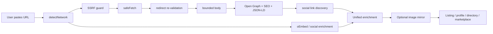
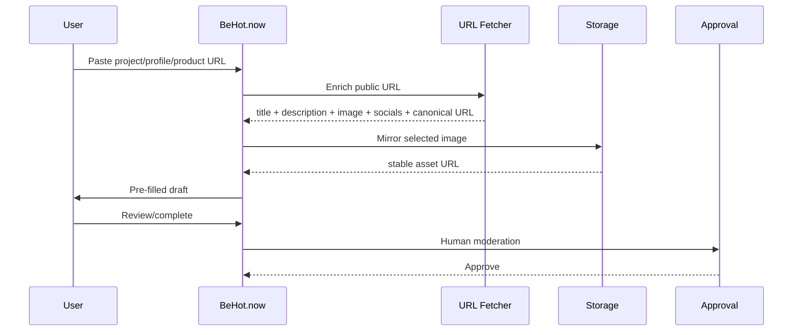
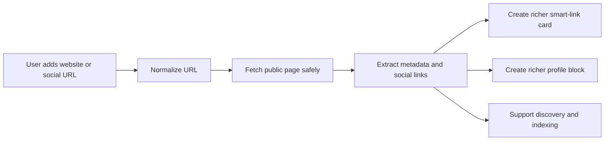

<div align="center">

# 🔎 URL Metadata & Social Profile Fetcher

### Paste a public URL → get structured metadata you can actually use.

**Production-oriented TypeScript URL enrichment for websites, user profiles, products, projects, startups, apps, social URLs and marketplaces.**

[](CHANGELOG.md)
[](https://www.typescriptlang.org/)
[](https://nodejs.org/)
[](package.json)
[](LICENSE)

**[Quick Start](#quick-start--one-api)** · **[Live Production](#-live-in-production)** · **[AI Agent](#-ai-agent-connection)** · **[Use Cases](#what-can-you-build)** · **[Architecture](#architecture)** · **[Security](#security-model)** · **[Support](#-support-development)**

</div>

> **URL in. Structured product data out.** Extract titles, descriptions, Open Graph and SEO metadata, canonical URLs, images, favicons, public social links, brand-color hints and available profile metrics — with SSRF-safe server-side fetching and optional remote-image mirroring.

`url-metadata-social-fetcher` is designed for the point where a product asks a user to paste a URL and should immediately turn that URL into a useful, editable record instead of another empty form. It is framework-agnostic TypeScript, has **zero runtime dependencies**, and uses standard Web APIs. Node.js 18+ is the primary supported runtime.

### Why builders use it

| Input | What you can create |
| --- | --- |
| Website / startup URL | Name, description, canonical URL, preview image, favicon, keywords, socials |
| Creator / user profile | Display name, bio, avatar, network, public metrics when available |
| Product / app / service | Rich listing draft, preview card, marketplace record, directory entry |
| Social URL | Normalized profile identity, oEmbed/public profile enrichment |
| Any untrusted public URL | Bounded, redirect-aware, SSRF-hardened fetch before extraction |

**Built from a real production pattern, not a demo-only parser.** The same class of URL enrichment is used live by **BeHot.Now** and **HORNO Space**.

---

## 🔥 Live in production

This is not only a reference implementation. The same URL-enrichment approach is already used in live products from **HRN Innovation Technologies Ltd** — turning pasted URLs into richer listing, profile and smart-link experiences.

### BeHot.Now — The Attention Marketplace

<a href="https://behot.now/get-hot">
  
</a>

**[→ Open the live BeHot.Now listing flow](https://behot.now/get-hot)**

[BeHot.Now](https://behot.now) is an attention marketplace where creators, startups, apps, brands, products, businesses, events, services and ideas can compete for visibility on live ranking boards.

The URL fetcher powers the **URL-first listing workflow**: a user submits a website, product, project or profile URL and BeHot can use public metadata to pre-fill useful listing information such as the **name/title, description, logo or preview image, canonical URL and discovered social links**. The user can then review the draft before the listing enters the platform workflow.

That pattern is especially valuable for **Outbid-style websites, paid ranking boards, startup launch directories and discovery marketplaces** because users do not need to manually retype public information that already exists on the URL they submit.

**Live:** [behot.now](https://behot.now) · **Try the flow:** [behot.now/get-hot](https://behot.now/get-hot) · **How it works:** [behot.now/how-it-works](https://behot.now/how-it-works)

### HORNO Space — Your digital world. One link.

<p align="center">
  <a href="https://space.horno.net">
    
  </a>
</p>

<a href="https://space.horno.net">
  
</a>

**[→ Open HORNO Space](https://space.horno.net)**

[HORNO Space](https://space.horno.net) is an **all-in-one digital identity and sharing platform** for creators, professionals, founders, recruiters and communities. One public Space can bring together a bio page, smart links, social profiles, a digital business card, articles, products and services, referral links, QR sharing, analytics, verification, community discovery, live experiences and a public profile designed to be discoverable on the web.

The same URL-enrichment functionality is used live in HORNO Space to make external URLs and profile links more useful. Instead of treating a submitted URL as plain text, the system can read the public page, normalize the destination and obtain usable metadata for **richer link cards, richer profile cards, previews and profile-building workflows**.

Typical HORNO Space enrichment use cases include:

- adding a website and obtaining a usable title, description, canonical URL and visual preview;
- importing public social/profile information where the source exposes it;
- generating richer smart-link cards instead of displaying only a raw URL;
- discovering public social links connected to a website;
- using favicon, Open Graph image or available profile imagery in presentation layers;
- normalizing external links before they are added to a user's digital identity;
- reducing manual profile setup when a user already has public information elsewhere;
- producing structured metadata that can support search, previews, discovery and indexing.

**Live:** [space.horno.net](https://space.horno.net) · **HORNO Network:** [horno.net](https://horno.net)

---

## 🧠 AI agent connection

This repository is also connected to the higher-level **[URL Intelligence Agent](https://github.com/vpicciuolo/url-intelligence-agent)** project.

The relationship is simple:

```text
url-metadata-social-fetcher
        ↓
Deterministic URL enrichment
        ↓
URL Intelligence Agent
        ↓
Entity resolution · evidence · crawling · trust signals · SEO · technology detection · reports · MCP · API · monitoring
```

Use this repository when you need a lightweight, deterministic TypeScript URL-enrichment layer. Use **URL Intelligence Agent** when you need deeper website intelligence, multi-page crawling, entity resolution, evidence scoring, public contact discovery, technology fingerprinting, SEO/security/trust analysis, reports, MCP tools, API access, monitoring or optional AI reasoning.

**AI Agent repository:** [github.com/vpicciuolo/url-intelligence-agent](https://github.com/vpicciuolo/url-intelligence-agent)

This cross-project relationship is intentional for developer discovery and AI indexing: the fetcher provides the lower-level extraction foundation, while the agent provides higher-level **URL intelligence, entity intelligence and evidence-first automation**.

---

## Why this exists

A URL field becomes infrastructure surprisingly quickly: redirects, expiring CDN images, inconsistent social metadata, Open Graph vs JSON-LD vs oEmbed, oversized responses, repeated requests and SSRF risk. This project packages a reusable engineering layer for those problems.

### v1.0.0.1 capabilities

| Capability | Included |
| --- | --- |
| URL safety | SSRF guard, private-network rejection, credentials/scheme/port validation |
| Redirect safety | Re-validation on every redirect hop |
| Resource limits | Whole-request timeout, streaming byte cap, redirect cap, content-type filtering |
| SEO metadata | title, description, canonical, author, date, locale, keywords, type |
| Social metadata | Open Graph, Twitter/X cards, JSON-LD, oEmbed |
| Social discovery | Public social/profile links found in anchors |
| Brand hints | theme/tile color metadata |
| Profile enrichment | name, bio, avatar, followers/subscribers/following/posts when publicly available |
| Networks | Instagram, Threads, Facebook, TikTok, YouTube, SoundCloud, Twitch, Spotify, X, GitHub, LinkedIn, Telegram, Pinterest, Snapchat, Discord |
| Images | OG/avatar/favicon discovery and optional mirroring |
| Cache | TTL memory cache + in-flight de-duplication |
| Storage | filesystem, generic HTTP PUT, memory |
| Runtime deps | 0 |

## Quick start — one API

```ts
import { enrichUrl } from 'url-metadata-social-fetcher';

const result = await enrichUrl('https://example.com');
console.log(result);
```

Typical website result:

```ts
{
  input: 'https://example.com',
  kind: 'website',
  network: 'website',
  canonicalUrl: 'https://example.com/',
  title: 'Example Domain',
  description: 'Example description',
  imageUrl: 'https://example.com/og.jpg',
  iconUrl: 'https://example.com/favicon.ico',
  themeColor: '#111111',
  brandColors: ['#111111'],
  keywords: ['example'],
  socialLinks: ['https://x.com/example']
}
```

Social profile:

```ts
const creator = await enrichUrl('https://www.instagram.com/nasa/');
console.log(creator?.kind);    // social-profile
console.log(creator?.network); // instagram
console.log(creator?.profile);
```

## Architecture



See [`docs/ARCHITECTURE.md`](docs/ARCHITECTURE.md).

## Live usage patterns

### BeHot.Now

BeHot.Now uses a URL-first onboarding pattern: paste a link, extract useful public metadata, create an editable draft, mirror stable assets when appropriate, then pass through moderation before public listing.



### HORNO Space

HORNO Space uses the same enrichment logic for smarter link and profile experiences. The system can turn a raw URL into a richer smart-link card, a better profile block or a more complete identity record.



See [`docs/BEHOT-LIVE.md`](docs/BEHOT-LIVE.md).

## What can you build?

### Ranking and discovery

- Outbid / bid-to-position websites
- pay-to-rank leaderboards
- startup launch boards
- Product Hunt-style directories
- AI/SaaS/developer-tool directories
- creator/music/brand charts
- sponsored resource lists
- community discovery boards

### Profiles and identity

- creator/influencer profiles
- artist/DJ/musician profiles
- founder/company profiles
- portfolio builders
- link-in-bio products
- claim-your-profile flows
- social-profile import/onboarding
- digital business cards
- link hubs and smart profile pages

### Marketplaces

- freelancer and creator marketplaces
- influencer campaign platforms
- agency/vendor/talent directories
- service/gig listings
- plugin/integration marketplaces
- seller onboarding with URL-first autofill

### Products, projects and content

- startup/product databases
- partner/investor portfolio pages
- crowdfunding project intake
- link previews and chat unfurling
- bookmark managers
- news/content curation
- podcast/music/video directories

### SEO, CRM and AI

- Open Graph debuggers
- canonical/metadata QA
- CRM website intake
- public lead/company cards
- RAG URL pre-processing
- agent tools that receive untrusted URLs
- website-to-JSON utilities

See the expanded matrix in [`docs/USE-CASES.md`](docs/USE-CASES.md).

## Installation

```bash
git clone https://github.com/vpicciuolo/url-metadata-social-fetcher.git
cd url-metadata-social-fetcher
npm install
npm test
npm run build
```

Once published to npm:

```bash
npm install url-metadata-social-fetcher
```

> Repository release: **v1.0.0.1**. npm requires three-part SemVer, so `package.json.version` is `1.0.0` while `VERSION`, `RELEASE_VERSION` and the changelog retain `1.0.0.1`.

## Core API examples

### Safe fetch

```ts
import { isSafeUrl, safeFetch } from 'url-metadata-social-fetcher';
if (!isSafeUrl(url)) throw new Error('Rejected');
const res = await safeFetch(url, { timeoutMs: 5000, maxBytes: 1_000_000, allowContentTypes: ['text/html'] });
```

### Page metadata

```ts
import { enrichPage } from 'url-metadata-social-fetcher';
const page = await enrichPage(url, { includeText: true });
console.log(page?.title, page?.description, page?.socialLinks);
```

### Social enrichment

```ts
import { enrichSocialProfile } from 'url-metadata-social-fetcher';
const profile = await enrichSocialProfile('https://x.com/example');
console.log(profile.displayName, profile.avatarUrl, profile.followers);
```

### Mirror images

```ts
import { createFileSystemTarget, mirrorImage } from 'url-metadata-social-fetcher';
const target = createFileSystemTarget('./public/media', '/media');
const mirrored = await mirrorImage(remoteImage, target);
```

### Build a listing draft

```ts
const enriched = await enrichUrl(userSubmittedUrl);
if (!enriched) throw new Error('Could not read URL');
const draft = {
  sourceUrl: userSubmittedUrl,
  canonicalUrl: enriched.canonicalUrl,
  name: enriched.title ?? '',
  description: enriched.description ?? '',
  image: enriched.imageUrl ?? enriched.iconUrl ?? '',
  socialLinks: enriched.socialLinks,
  tags: enriched.keywords,
  sourceNetwork: enriched.network,
  status: 'draft'
};
```

## Supported social detection

| Network | Common profile form |
| --- | --- |
| Instagram | `instagram.com/name` |
| Threads | `threads.net/@name` |
| Facebook | `facebook.com/name` |
| TikTok | `tiktok.com/@name` |
| YouTube | `youtube.com/@name`, `/user/name` |
| SoundCloud | `soundcloud.com/name` |
| Twitch | `twitch.tv/name` |
| Spotify | `open.spotify.com/artist/id` |
| X/Twitter | `x.com/name`, `twitter.com/name` |
| GitHub | `github.com/name` |
| LinkedIn | `/in/name`, `/company/name` |
| Telegram | `t.me/name` |
| Pinterest | `pinterest.com/name` |
| Snapchat | `snapchat.com/add/name` |
| Discord | `discord.gg/code`, `/invite/code` |

Detection does not mean every platform exposes every metric publicly. The library returns the best available public data and fails soft when platforms limit access.

## Security model

The guard rejects non-HTTP(S) schemes, credentials in URLs, loopback/private/link-local/metadata targets, internal-style hostnames and unexpected ports. Redirects are followed manually and every destination is validated again. Response bodies are bounded by time and bytes.

**DNS rebinding:** hostname checks alone cannot guarantee resolved IP safety. In high-risk multi-tenant infrastructure, also enforce private/reserved IP blocking at DNS/egress/firewall level. See [`SECURITY.md`](SECURITY.md).

Fetched content remains **untrusted input**: sanitize/output-encode it, apply length limits and never treat imported metadata as a moderation decision.

## Image mirroring

Remote social/CDN images can expire or block hotlinking. `mirrorImage()` creates a stable SHA-256-based key and stores the file in infrastructure you control. v1.0.0.1 also checks known extensions before re-downloading an already mirrored image.

## Repository layout

```text
src/core          SSRF guard, safe fetch, cache
src/extractors    metadata, JSON-LD, text, social links
src/providers     network detection, oEmbed, social enrichment
src/storage       image mirroring and targets
src/enrich-url.ts unified product-facing API
examples          practical integration examples
test              offline Vitest suites
docs              architecture, API, BeHot live use, recipes, use cases
.github           CI, CodeQL, Dependabot, issue/PR templates
```

## Configuration

```env
FETCH_TIMEOUT_MS=8000
FETCH_MAX_BYTES=2000000
FETCH_MAX_REDIRECTS=3
FETCH_USER_AGENT="url-metadata-social-fetcher/1.0.0.1 (+https://github.com/vpicciuolo/url-metadata-social-fetcher)"
UNFURL_API_URL=
UNFURL_API_KEY=
```

## Important limitations

This project does not bypass authentication, bot protection, captchas, paywalls or access controls; does not promise follower metrics from every social platform; does not execute arbitrary page JavaScript; and does not replace official APIs when your use case requires them. Review platform terms and applicable law, rate-limit requests and cache responsibly.

## Versioning

Current repository release: **v1.0.0.1**. See [`CHANGELOG.md`](CHANGELOG.md).

## Discoverability keywords

Natural project terms: **URL metadata fetcher, URL metadata parser, metadata extractor, Open Graph parser, SEO metadata extractor, social profile fetcher, link preview generator, URL unfurling, oEmbed TypeScript, SSRF safe fetch, social profile enrichment, website metadata API, image mirroring, directory listing autofill, startup directory, creator profile importer, Outbid leaderboard tooling, AI URL intelligence, entity intelligence, evidence-first web intelligence, website intelligence agent, URL intelligence agent, MCP URL tools, AI agent web enrichment**.

Recommended GitHub settings/topics are in [`docs/DISCOVERABILITY.md`](docs/DISCOVERABILITY.md).

## Credits

Created by **Vincenzo Picciuolo**, Founder & Lead Engineer, **HRN Innovation Technologies Ltd**.

- GitHub: [@vpicciuolo](https://github.com/vpicciuolo)
- AI intelligence project: [URL Intelligence Agent](https://github.com/vpicciuolo/url-intelligence-agent)
- Live production showcase: [BeHot.Now](https://behot.now)
- Live production showcase: [HORNO Space](https://space.horno.net)
- HORNO Network: [horno.net](https://horno.net)
- Easy HORNO: [easy.horno.net](https://easy.horno.net)
- URL submission flow: [BeHot.Now / Get Hot](https://behot.now/get-hot)

### Follow the projects on X

Follow the builder and the live projects for updates, releases, experiments and new open-source work:

- **Vincenzo Picciuolo:** [@vpicciuolo](https://x.com/vpicciuolo)
- **HORNO Network:** [@hornonetwork](https://x.com/hornonetwork)
- **BeHot.Now:** [@BeHotNow2026](https://x.com/BeHotNow2026)

### ❤️ Support development

If this open-source project helps your platform, product or workflow, you can support continued development through the dedicated support page.

[](https://hrn.ae/githubsupport)

**[→ Support continued open-source development](https://hrn.ae/githubsupport)**

The support page is hosted externally so the Stripe Buy Button can run normally outside GitHub README restrictions.

## License

MIT © 2026 HRN Innovation Technologies Ltd — Founder: Vincenzo Picciuolo. See [`LICENSE`](LICENSE).

If this project helps your product, **star the repository** so other builders can discover it.