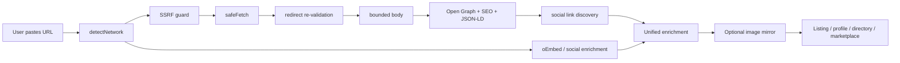
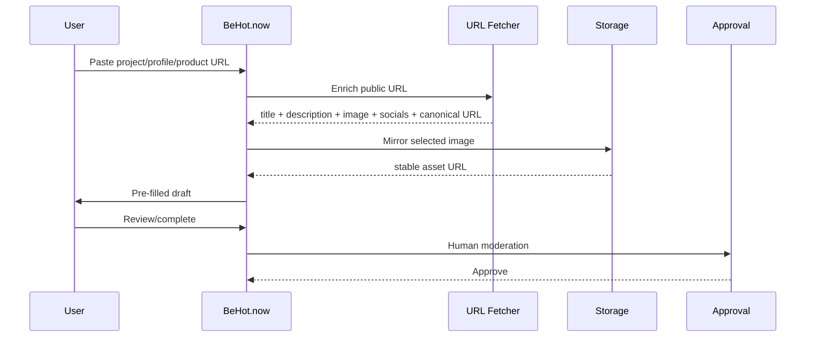

<p align="center"></p>

# URL Metadata & Social Profile Fetcher

[](CHANGELOG.md) [](https://www.typescriptlang.org/) [](https://nodejs.org/) [](package.json) [](LICENSE) [](https://github.com/vpicciuolo/url-metadata-social-fetcher/actions/workflows/ci.yml)

**Paste a public URL. Get structured metadata you can actually use.**

`url-metadata-social-fetcher` is a production-oriented TypeScript toolkit for **URL metadata extraction, Open Graph parsing, SEO metadata, social profile enrichment, link previews, URL unfurling, public social-link discovery, SSRF-safe server-side fetching and remote-image mirroring**.

It is designed for the moment a product asks a user to paste a website, creator profile, product, project, startup, app, song, marketplace listing or social URL. From that one input you can build a richer record containing a title/name, description/bio, canonical URL, preview image, favicon/avatar, social links, keywords, theme-color hints and available public profile metrics.

The core has **zero runtime dependencies** and uses standard Web APIs. Node.js 18+ is the primary supported runtime.

> **Live production showcase:** this repository open-sources the URL-enrichment pattern used in the live [BeHot.now](https://behot.now) listing flow. On [Get Hot](https://behot.now/get-hot), a user pastes a link and BeHot builds the listing; the public [How it works](https://behot.now/how-it-works) page describes the auto-fill flow for name, logo, description and socials before human approval.

## Why this exists

A URL field becomes infrastructure surprisingly quickly: redirects, expiring CDN images, inconsistent social metadata, Open Graph vs JSON-LD vs oEmbed, oversized responses, repeated requests and SSRF risk. This project packages a reusable engineering layer for those problems.

### v1.0.0.1 capabilities

| Capability | Included |
| --- | --- |
| URL safety | SSRF guard, private-network rejection, credentials/scheme/port validation |
| Redirect safety | Re-validation on every redirect hop |
| Resource limits | Whole-request timeout, streaming byte cap, redirect cap, content-type filtering |
| SEO metadata | title, description, canonical, author, date, locale, keywords, type |
| Social metadata | Open Graph, Twitter/X cards, JSON-LD, oEmbed |
| Social discovery | Public social/profile links found in anchors |
| Brand hints | theme/tile color metadata |
| Profile enrichment | name, bio, avatar, followers/subscribers/following/posts when publicly available |
| Networks | Instagram, Threads, Facebook, TikTok, YouTube, SoundCloud, Twitch, Spotify, X, GitHub, LinkedIn, Telegram, Pinterest, Snapchat, Discord |
| Images | OG/avatar/favicon discovery and optional mirroring |
| Cache | TTL memory cache + in-flight de-duplication |
| Storage | filesystem, generic HTTP PUT, memory |
| Runtime deps | 0 |

## Quick start — one API

```ts
import { enrichUrl } from 'url-metadata-social-fetcher';

const result = await enrichUrl('https://example.com');
console.log(result);
```

Typical website result:

```ts
{
  input: 'https://example.com',
  kind: 'website',
  network: 'website',
  canonicalUrl: 'https://example.com/',
  title: 'Example Domain',
  description: 'Example description',
  imageUrl: 'https://example.com/og.jpg',
  iconUrl: 'https://example.com/favicon.ico',
  themeColor: '#111111',
  brandColors: ['#111111'],
  keywords: ['example'],
  socialLinks: ['https://x.com/example']
}
```

Social profile:

```ts
const creator = await enrichUrl('https://www.instagram.com/nasa/');
console.log(creator?.kind);    // social-profile
console.log(creator?.network); // instagram
console.log(creator?.profile);
```

## Architecture



See [`docs/ARCHITECTURE.md`](docs/ARCHITECTURE.md).

## Live usage: BeHot.now

BeHot.now uses a URL-first onboarding pattern: paste a link, extract useful public metadata, create an editable draft, mirror stable assets when appropriate, then pass through moderation before public listing.



This is especially useful for **Outbid-style paid ranking sites**, startup launch boards and discovery products where users should not retype public information already available at the submitted URL. See [`docs/BEHOT-LIVE.md`](docs/BEHOT-LIVE.md).

## What can you build?

### Ranking and discovery

- Outbid / bid-to-position websites
- pay-to-rank leaderboards
- startup launch boards
- Product Hunt-style directories
- AI/SaaS/developer-tool directories
- creator/music/brand charts
- sponsored resource lists
- community discovery boards

### Profiles and identity

- creator/influencer profiles
- artist/DJ/musician profiles
- founder/company profiles
- portfolio builders
- link-in-bio products
- claim-your-profile flows
- social-profile import/onboarding

### Marketplaces

- freelancer and creator marketplaces
- influencer campaign platforms
- agency/vendor/talent directories
- service/gig listings
- plugin/integration marketplaces

### Products, projects and content

- startup/product databases
- partner/investor portfolio pages
- crowdfunding project intake
- link previews and chat unfurling
- bookmark managers
- news/content curation
- podcast/music/video directories

### SEO, CRM and AI

- Open Graph debuggers
- canonical/metadata QA
- CRM website intake
- public lead/company cards
- RAG URL pre-processing
- agent tools that receive untrusted URLs
- website-to-JSON utilities

See the expanded matrix in [`docs/USE-CASES.md`](docs/USE-CASES.md).

## Installation

```bash
git clone https://github.com/vpicciuolo/url-metadata-social-fetcher.git
cd url-metadata-social-fetcher
npm install
npm test
npm run build
```

Once published to npm:

```bash
npm install url-metadata-social-fetcher
```

> Repository release: **v1.0.0.1**. npm requires three-part SemVer, so `package.json.version` is `1.0.0` while `VERSION`, `RELEASE_VERSION` and the changelog retain `1.0.0.1`.

## Core API examples

### Safe fetch

```ts
import { isSafeUrl, safeFetch } from 'url-metadata-social-fetcher';
if (!isSafeUrl(url)) throw new Error('Rejected');
const res = await safeFetch(url, { timeoutMs: 5000, maxBytes: 1_000_000, allowContentTypes: ['text/html'] });
```

### Page metadata

```ts
import { enrichPage } from 'url-metadata-social-fetcher';
const page = await enrichPage(url, { includeText: true });
console.log(page?.title, page?.description, page?.socialLinks);
```

### Social enrichment

```ts
import { enrichSocialProfile } from 'url-metadata-social-fetcher';
const profile = await enrichSocialProfile('https://x.com/example');
console.log(profile.displayName, profile.avatarUrl, profile.followers);
```

### Mirror images

```ts
import { createFileSystemTarget, mirrorImage } from 'url-metadata-social-fetcher';
const target = createFileSystemTarget('./public/media', '/media');
const mirrored = await mirrorImage(remoteImage, target);
```

### Build a listing draft

```ts
const enriched = await enrichUrl(userSubmittedUrl);
if (!enriched) throw new Error('Could not read URL');
const draft = {
  sourceUrl: userSubmittedUrl,
  canonicalUrl: enriched.canonicalUrl,
  name: enriched.title ?? '',
  description: enriched.description ?? '',
  image: enriched.imageUrl ?? enriched.iconUrl ?? '',
  socialLinks: enriched.socialLinks,
  tags: enriched.keywords,
  sourceNetwork: enriched.network,
  status: 'draft'
};
```

## Supported social detection

| Network | Common profile form |
| --- | --- |
| Instagram | `instagram.com/name` |
| Threads | `threads.net/@name` |
| Facebook | `facebook.com/name` |
| TikTok | `tiktok.com/@name` |
| YouTube | `youtube.com/@name`, `/user/name` |
| SoundCloud | `soundcloud.com/name` |
| Twitch | `twitch.tv/name` |
| Spotify | `open.spotify.com/artist/id` |
| X/Twitter | `x.com/name`, `twitter.com/name` |
| GitHub | `github.com/name` |
| LinkedIn | `/in/name`, `/company/name` |
| Telegram | `t.me/name` |
| Pinterest | `pinterest.com/name` |
| Snapchat | `snapchat.com/add/name` |
| Discord | `discord.gg/code`, `/invite/code` |

Detection does not mean every platform exposes every metric publicly. The library returns the best available public data and fails soft when platforms limit access.

## Security model

The guard rejects non-HTTP(S) schemes, credentials in URLs, loopback/private/link-local/metadata targets, internal-style hostnames and unexpected ports. Redirects are followed manually and every destination is validated again. Response bodies are bounded by time and bytes.

**DNS rebinding:** hostname checks alone cannot guarantee resolved IP safety. In high-risk multi-tenant infrastructure, also enforce private/reserved IP blocking at DNS/egress/firewall level. See [`SECURITY.md`](SECURITY.md).

Fetched content remains **untrusted input**: sanitize/output-encode it, apply length limits and never treat imported metadata as a moderation decision.

## Image mirroring

Remote social/CDN images can expire or block hotlinking. `mirrorImage()` creates a stable SHA-256-based key and stores the file in infrastructure you control. v1.0.0.1 also checks known extensions before re-downloading an already mirrored image.

## Repository layout

```text
src/core          SSRF guard, safe fetch, cache
src/extractors    metadata, JSON-LD, text, social links
src/providers     network detection, oEmbed, social enrichment
src/storage       image mirroring and targets
src/enrich-url.ts unified product-facing API
examples          practical integration examples
test              offline Vitest suites
docs              architecture, API, BeHot live use, recipes, use cases
.github            CI, CodeQL, Dependabot, issue/PR templates
```

## Configuration

```env
FETCH_TIMEOUT_MS=8000
FETCH_MAX_BYTES=2000000
FETCH_MAX_REDIRECTS=3
FETCH_USER_AGENT="url-metadata-social-fetcher/1.0.0.1 (+https://github.com/vpicciuolo/url-metadata-social-fetcher)"
UNFURL_API_URL=
UNFURL_API_KEY=
```

## Important limitations

This project does not bypass authentication, bot protection, captchas, paywalls or access controls; does not promise follower metrics from every social platform; does not execute arbitrary page JavaScript; and does not replace official APIs when your use case requires them. Review platform terms and applicable law, rate-limit requests and cache responsibly.

## Versioning

Current repository release: **v1.0.0.1**. See [`CHANGELOG.md`](CHANGELOG.md).

## Discoverability keywords

Natural project terms: **URL metadata fetcher, URL metadata parser, metadata extractor, Open Graph parser, SEO metadata extractor, social profile fetcher, link preview generator, URL unfurling, oEmbed TypeScript, SSRF safe fetch, social profile enrichment, website metadata API, image mirroring, directory listing autofill, startup directory, creator profile importer, Outbid leaderboard tooling**.

Recommended GitHub settings/topics are in [`docs/DISCOVERABILITY.md`](docs/DISCOVERABILITY.md).

## Credits

Created by **Vincenzo Picciuolo**, Founder & Lead Engineer, **HRN Innovation Technologies Ltd**.

- GitHub: [@vpicciuolo](https://github.com/vpicciuolo)
- Live showcase: [BeHot.now](https://behot.now)
- URL submission flow: [BeHot.now/Get Hot](https://behot.now/get-hot)

## License

MIT © 2026 HRN Innovation Technologies Ltd — Founder: Vincenzo Picciuolo. See [`LICENSE`](LICENSE).

If this project helps your product, **star the repository** so other builders can discover it.
