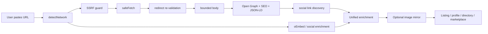

<h1 align="center">URL Metadata & Social Profile Fetcher</h1>

<p align="center"><strong>Turn any public URL into structured, product-ready metadata.</strong></p>

<p align="center">
  <a href="CHANGELOG.md"></a>
  <a href="https://www.typescriptlang.org/"></a>
  <a href="https://nodejs.org/"></a>
  <a href="package.json"></a>
  <a href="LICENSE"></a>
  <a href="https://github.com/vpicciuolo/url-metadata-social-fetcher/actions/workflows/ci.yml"></a>
</p>

<p align="center"><strong>Open Graph · SEO · JSON-LD · oEmbed · Social Profiles · Link Unfurling · SSRF-Hardened Fetching · Image Mirroring</strong></p>

`url-metadata-social-fetcher` is a production-oriented TypeScript toolkit for turning **websites, creator profiles, products, projects, startups, apps, songs, marketplace listings and social URLs** into normalized data your application can actually use.

From one public URL you can obtain, when available: title/name, description/bio, canonical URL, Open Graph and SEO metadata, JSON-LD, oEmbed, favicon/logo/avatar/preview imagery, public social links, public profile metrics, keywords, locale, author, publish date and brand/theme-color hints.

The core has **zero runtime dependencies** and uses standard Web APIs. **Node.js 18+** is the primary supported runtime.

---

## 🔥 Live in production

This repository is not only a reference implementation. The same URL-enrichment pattern is already used in live products built by **HRN Innovation Technologies Ltd**.

### BeHot.Now — The Attention Marketplace

<a href="https://behot.now/get-hot">
  
</a>

<p align="center"><strong><a href="https://behot.now/get-hot">🔥 Try the live URL-first listing flow on BeHot.Now →</a></strong></p>

[BeHot.Now](https://behot.now) is an **attention marketplace** where creators, startups, apps, brands, products, businesses, events, services and ideas can compete for visibility on live ranking boards.

The fetcher powers a **URL-first onboarding workflow**: a user pastes a website, project, product or profile URL and the platform can pre-fill useful listing data such as **name/title, description, logo or preview image, canonical URL and discovered social links**. The user reviews the draft instead of retyping public information that already exists.

This pattern is especially useful for **Outbid-style bid-to-position websites, paid ranking boards, startup launch directories, product/SaaS directories, creator charts, marketplaces and sponsored discovery pages**.

**Live:** [behot.now](https://behot.now) · **Create a listing:** [behot.now/get-hot](https://behot.now/get-hot) · **How it works:** [behot.now/how-it-works](https://behot.now/how-it-works)

### HORNO Space — Your digital world. One link.

<p align="center">
  <a href="https://space.horno.net">
    
  </a>
</p>

<a href="https://space.horno.net">
  
</a>

<p align="center"><strong><a href="https://space.horno.net">🚀 Open HORNO Space →</a></strong></p>

[HORNO Space](https://space.horno.net) is an **all-in-one digital identity and sharing hub**. A single public Space can bring together a bio link, digital business card, social profiles, smart links, products and services, referral links, QR sharing, live sessions and community-facing identity in one URL.

The same URL-enrichment functionality is used live in HORNO Space to turn raw links into richer **smart-link cards and profile blocks** with title, description, canonical URL, imagery and discovered social connections when available.

Typical HORNO Space uses include website/profile import, rich smart-link generation, public social discovery, favicon/Open Graph image extraction, external-link normalization, reduced manual profile setup, and structured metadata for previews, discovery and indexing.

**Live:** [space.horno.net](https://space.horno.net) · **HORNO Network:** [horno.net](https://horno.net)

---

## ⚡ One URL → useful product data

| Input | Enrichment | Output | Product use |
| --- | --- | --- | --- |
| Website | SEO + Open Graph + JSON-LD | title, description, image, canonical URL, socials | directories, marketplaces, previews |
| Creator profile | profile detection + public metadata | display name, bio, avatar, metrics when exposed | creator onboarding |
| Product/startup URL | page metadata + imagery | listing draft | launch boards, rankings, catalogs |
| Article/content URL | metadata + text extraction | structured source record | curation, RAG, research tools |
| Remote image | bounded safe fetch + mirror | stable controlled URL | durable cards/listings |

```ts
import { enrichUrl } from 'url-metadata-social-fetcher';

const result = await enrichUrl('https://example.com');
console.log(result);
```

## Why this exists

A simple URL field becomes infrastructure quickly: redirects, expiring CDN images, inconsistent metadata, Open Graph vs JSON-LD vs oEmbed, oversized responses, repeated requests and SSRF risk. This project packages a reusable engineering layer for those problems.

### v1.0.0.1 capabilities

| Capability | Included |
| --- | --- |
| URL safety | SSRF guard, private-network rejection, credentials/scheme/port validation |
| Redirect safety | Re-validation on every redirect hop |
| Resource limits | Whole-request timeout, streaming byte cap, redirect cap, content-type filtering |
| SEO metadata | title, description, canonical, author, date, locale, keywords, type |
| Social metadata | Open Graph, Twitter/X cards, JSON-LD, oEmbed |
| Social discovery | Public social/profile links found in anchors |
| Brand hints | theme/tile color metadata |
| Profile enrichment | name, bio, avatar, followers/subscribers/following/posts when publicly available |
| Networks | Instagram, Threads, Facebook, TikTok, YouTube, SoundCloud, Twitch, Spotify, X, GitHub, LinkedIn, Telegram, Pinterest, Snapchat, Discord |
| Images | OG/avatar/favicon discovery and optional mirroring |
| Cache | TTL memory cache + in-flight de-duplication |
| Storage | filesystem, generic HTTP PUT, memory |
| Runtime dependencies | 0 |

## Quick start

```bash
git clone https://github.com/vpicciuolo/url-metadata-social-fetcher.git
cd url-metadata-social-fetcher
npm install
npm test
npm run build
```

Once published to npm:

```bash
npm install url-metadata-social-fetcher
```

> Repository release: **v1.0.0.1**. npm uses three-part SemVer, so `package.json.version` remains `1.0.0` while `VERSION`, `RELEASE_VERSION` and the changelog retain `1.0.0.1`.

## Architecture



See [`docs/ARCHITECTURE.md`](docs/ARCHITECTURE.md).

## What can you build?

- Outbid / bid-to-position websites and paid visibility boards
- startup, SaaS, AI and developer-tool directories
- creator, influencer, artist, DJ, music and brand charts
- profile import, link-in-bio products and digital business cards
- marketplaces, seller onboarding and service/gig listings
- startup/product databases and crowdfunding project intake
- link previews, URL unfurling and smart-link services
- SEO/Open Graph debugging and website-to-JSON tooling
- CRM, lead, partner, vendor and exhibitor onboarding
- RAG URL pre-processing, AI research tools and agent pipelines

See [`docs/USE-CASES.md`](docs/USE-CASES.md) for the expanded matrix.

## Supported social detection

Instagram · Threads · Facebook · TikTok · YouTube · SoundCloud · Twitch · Spotify · X/Twitter · GitHub · LinkedIn · Telegram · Pinterest · Snapchat · Discord

Detection does not mean every platform exposes every metric publicly. The library returns the best available public data and fails soft when platforms limit access.

## Security model

The guard rejects non-HTTP(S) schemes, credentials in URLs, loopback/private/link-local/metadata targets, internal-style hostnames and unexpected ports. Redirects are followed manually and every destination is validated again. Response bodies are bounded by time and bytes.

**DNS rebinding:** hostname checks alone cannot guarantee resolved-IP safety. In high-risk multi-tenant infrastructure, also enforce private/reserved IP blocking at DNS, egress or firewall level. See [`SECURITY.md`](SECURITY.md).

Fetched content remains **untrusted input**: sanitize/output-encode it, apply length limits and never treat imported metadata as a moderation decision.

## Repository layout

```text
src/core          SSRF guard, safe fetch, cache
src/extractors    metadata, JSON-LD, text, social links
src/providers     network detection, oEmbed, social enrichment
src/storage       image mirroring and targets
src/enrich-url.ts unified product-facing API
examples          practical integrations
test              offline Vitest suites
docs              architecture, API, live use, recipes, use cases
assets            README PNG assets
.github           CI, CodeQL, Dependabot, issue/PR templates
```

## Credits

Created by **Vincenzo Picciuolo**, Founder & Lead Engineer, **HRN Innovation Technologies Ltd**.

- GitHub: [@vpicciuolo](https://github.com/vpicciuolo)
- Live showcase: [BeHot.Now](https://behot.now)
- Live showcase: [HORNO Space](https://space.horno.net)
- URL submission flow: [BeHot.Now / Get Hot](https://behot.now/get-hot)

## 💜 Support development

If this open-source project helps your product or workflow, you can support ongoing development via Stripe:

<p align="center">
  <a href="https://vpicciuolo.github.io/url-metadata-social-fetcher/support.html"></a>
</p>

GitHub README pages do not execute Stripe JavaScript/custom elements, so the Stripe Buy Button itself lives on [`docs/support.html`](docs/support.html) and is deployed through GitHub Pages.

## License

MIT © 2026 HRN Innovation Technologies Ltd — Founder: Vincenzo Picciuolo. See [`LICENSE`](LICENSE).

If this project helps your product, **star the repository** so other builders can discover it.
