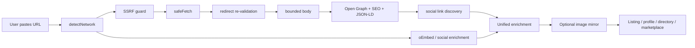
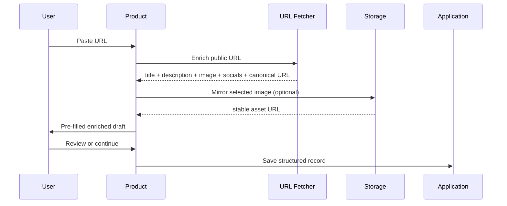

<h1 align="center">URL Metadata & Social Profile Fetcher</h1>

<p align="center"><strong>Turn a public URL into structured, product-ready metadata.</strong></p>

<p align="center">
  <a href="CHANGELOG.md"></a>
  <a href="https://www.typescriptlang.org/"></a>
  <a href="https://nodejs.org/"></a>
  <a href="package.json"></a>
  <a href="LICENSE"></a>
  <a href="https://github.com/vpicciuolo/url-metadata-social-fetcher/actions/workflows/ci.yml"></a>
</p>

<p align="center"><strong>Open Graph · SEO · JSON-LD · oEmbed · Social Profiles · Link Unfurling · SSRF-Hardened Fetching · Image Mirroring</strong></p>

`url-metadata-social-fetcher` is a production-oriented TypeScript toolkit for turning **websites, creator profiles, products, projects, startups, apps, songs, marketplace listings and social URLs** into normalized data your application can actually use.

From one public URL you can obtain, when available:

- title, name, description and bio;
- canonical URL and page type;
- Open Graph, Twitter/X card and SEO metadata;
- JSON-LD and oEmbed data;
- favicon, logo, avatar and preview imagery;
- public social/profile links discovered on the page;
- public follower/subscriber/following/post metrics where exposed;
- keywords, locale, author, publish date and brand/theme-color hints;
- optional mirrored images stored under infrastructure you control.

The core has **zero runtime dependencies** and uses standard Web APIs. **Node.js 18+** is the primary supported runtime.

---

## 🔥 Live in production

This repository is not only a reference implementation. The same URL-enrichment pattern is already used in live products built by HRN Innovation Technologies Ltd.

### BeHot.Now — The Attention Marketplace

<a href="https://behot.now/get-hot">
  
</a>

<p align="center"><strong><a href="https://behot.now/get-hot">🔥 Try the live URL-first listing flow on BeHot.Now →</a></strong></p>

[BeHot.Now](https://behot.now) is an **attention marketplace** where creators, startups, apps, brands, products, businesses, events, services and ideas can compete for visibility on live ranking boards.

The fetcher powers a **URL-first onboarding workflow**: a user pastes a website, project, product or profile URL and the platform can pre-fill useful listing data such as **name/title, description, logo or preview image, canonical URL and discovered social links**. The user reviews the draft instead of retyping public information that already exists.

That pattern is especially useful for:

- **Outbid-style bid-to-position websites**;
- paid ranking and visibility boards;
- startup launch directories;
- product and SaaS directories;
- creator and influencer charts;
- discovery marketplaces and sponsored listings.

**Live:** [behot.now](https://behot.now) · **Create a listing:** [behot.now/get-hot](https://behot.now/get-hot) · **How it works:** [behot.now/how-it-works](https://behot.now/how-it-works)

### HORNO Space — Your digital world. One link.

<p align="center">
  <a href="https://space.horno.net">
    
  </a>
</p>

<a href="https://space.horno.net">
  
</a>

<p align="center"><strong><a href="https://space.horno.net">🚀 Open HORNO Space →</a></strong></p>

[HORNO Space](https://space.horno.net) is an **all-in-one digital identity and sharing hub**. A single public Space can bring together a bio link, digital business card, social profiles, smart links, products and services, referral links, QR sharing, live sessions and community-facing identity in one URL.

The same URL-enrichment functionality is used live in HORNO Space to make external links and profile-building workflows richer. Instead of storing only a raw URL, the system can read public metadata and turn the destination into a more useful **smart-link card or profile block** with title, description, canonical URL, imagery and discovered social connections when available.

Typical HORNO Space uses include:

- adding a website and obtaining a usable title, description, canonical URL and preview;
- importing public profile information where the source exposes it;
- generating richer smart-link cards instead of showing only a raw URL;
- discovering public social links connected to a website;
- using favicon, Open Graph image or available profile imagery in presentation layers;
- normalizing external URLs before they become part of a digital identity;
- reducing manual profile setup;
- producing structured metadata that can support search, previews, discovery and indexing.

**Live:** [space.horno.net](https://space.horno.net) · **HORNO Network:** [horno.net](https://horno.net)

---

## ⚡ One URL → useful product data

| Input | Enrichment | Output | Product use |
| --- | --- | --- | --- |
| Website | SEO + Open Graph + JSON-LD | title, description, image, canonical URL, socials | directories, marketplaces, previews |
| Creator profile | profile detection + public metadata | display name, bio, avatar, metrics when exposed | influencer/creator onboarding |
| Product or startup URL | page metadata + imagery | listing draft | launch boards, rankings, catalogs |
| Article/content URL | metadata + text extraction | structured source record | curation, RAG, research tools |
| External image | bounded safe fetch + mirror | stable local/owned URL | long-lived cards and listings |

```ts
import { enrichUrl } from 'url-metadata-social-fetcher';

const result = await enrichUrl('https://example.com');
console.log(result);
```

---

## Why this exists

A simple URL field becomes infrastructure surprisingly quickly: redirects, expiring CDN images, inconsistent social metadata, Open Graph vs JSON-LD vs oEmbed, oversized responses, repeated requests and SSRF risk.

This project packages a reusable engineering layer for those problems so the rest of your product can work with normalized data instead of raw, unpredictable web pages.

### v1.0.0.1 capabilities

| Capability | Included |
| --- | --- |
| URL safety | SSRF guard, private-network rejection, credentials/scheme/port validation |
| Redirect safety | Re-validation on every redirect hop |
| Resource limits | Whole-request timeout, streaming byte cap, redirect cap, content-type filtering |
| SEO metadata | title, description, canonical, author, date, locale, keywords, type |
| Social metadata | Open Graph, Twitter/X cards, JSON-LD, oEmbed |
| Social discovery | Public social/profile links found in anchors |
| Brand hints | theme/tile color metadata |
| Profile enrichment | name, bio, avatar, followers/subscribers/following/posts when publicly available |
| Networks | Instagram, Threads, Facebook, TikTok, YouTube, SoundCloud, Twitch, Spotify, X, GitHub, LinkedIn, Telegram, Pinterest, Snapchat, Discord |
| Images | OG/avatar/favicon discovery and optional mirroring |
| Cache | TTL memory cache + in-flight de-duplication |
| Storage | filesystem, generic HTTP PUT, memory |
| Runtime dependencies | 0 |

## Quick start

```bash
git clone https://github.com/vpicciuolo/url-metadata-social-fetcher.git
cd url-metadata-social-fetcher
npm install
npm test
npm run build
```

Once published to npm:

```bash
npm install url-metadata-social-fetcher
```

> Repository release: **v1.0.0.1**. npm uses three-part SemVer, so `package.json.version` remains `1.0.0` while `VERSION`, `RELEASE_VERSION` and the changelog retain the repository release identifier `1.0.0.1`.

## Typical result

```ts
{
  input: 'https://example.com',
  kind: 'website',
  network: 'website',
  canonicalUrl: 'https://example.com/',
  title: 'Example Domain',
  description: 'Example description',
  imageUrl: 'https://example.com/og.jpg',
  iconUrl: 'https://example.com/favicon.ico',
  themeColor: '#111111',
  brandColors: ['#111111'],
  keywords: ['example'],
  socialLinks: ['https://x.com/example']
}
```

Social profile:

```ts
const creator = await enrichUrl('https://www.instagram.com/nasa/');
console.log(creator?.kind);    // social-profile
console.log(creator?.network); // instagram
console.log(creator?.profile);
```

## Architecture



See [`docs/ARCHITECTURE.md`](docs/ARCHITECTURE.md).

## Production workflow



BeHot.Now uses this pattern for listing creation; HORNO Space uses the same class of URL enrichment for richer external links and profile-oriented experiences.

## What can you build?

### Ranking and discovery

- Outbid / bid-to-position websites
- paid visibility boards
- pay-to-rank leaderboards
- startup launch boards
- Product Hunt-style directories
- AI, SaaS and developer-tool directories
- creator, influencer, artist, music and brand charts
- sponsored resource lists
- community discovery boards
- trending pages and launch aggregators

### Profiles and digital identity

- creator and influencer profiles
- artist, DJ and musician profiles
- founder and company profiles
- portfolio builders
- personal landing pages
- link-in-bio platforms
- digital business cards
- claim-your-profile workflows
- social-profile import and onboarding
- public member, speaker and talent directories

### Marketplaces and services

- freelancer and creator marketplaces
- influencer campaign platforms
- agency/vendor/talent directories
- service and gig listings
- expert and consultant marketplaces
- plugin and integration marketplaces
- partner ecosystems
- seller, supplier and vendor onboarding

### Products, projects and startups

- startup and product databases
- SaaS and app catalogs
- AI project catalogs
- project showcase pages
- investor and accelerator portfolio pages
- incubator and demo-day directories
- crowdfunding project intake
- public grant/project directories
- ecosystem maps

### Links, previews and content

- link previews and URL unfurling
- chat and collaboration-tool cards
- bookmark managers and reading lists
- curated directories
- news and content aggregation
- podcast, music and video directories
- article import and resource libraries
- smart-link services
- short-link enrichment

### SEO and web intelligence

- Open Graph debuggers
- metadata validators
- canonical URL QA
- social-card preview tools
- favicon discovery
- JSON-LD extraction
- public SEO audits
- website-to-JSON utilities
- page classification pipelines
- metadata monitoring
- content migration tooling

### CRM, sales and onboarding

- CRM website intake
- public company and lead cards
- lead enrichment from a submitted URL
- sales prospecting interfaces
- partner/customer/vendor onboarding
- affiliate profile creation
- event exhibitor and sponsor onboarding
- automatic organization/profile drafts

### AI, agents and RAG

- RAG URL pre-processing
- agent tools that receive untrusted URLs
- website-to-structured-context pipelines
- URL classification before indexing
- metadata enrichment before embedding
- AI research tools
- source-preview generation
- knowledge-base ingestion
- public-profile context collection
- automated URL triage

See the expanded matrix in [`docs/USE-CASES.md`](docs/USE-CASES.md).

## Core API examples

### Safe fetch

```ts
import { isSafeUrl, safeFetch } from 'url-metadata-social-fetcher';

if (!isSafeUrl(url)) throw new Error('Rejected');

const res = await safeFetch(url, {
  timeoutMs: 5000,
  maxBytes: 1_000_000,
  allowContentTypes: ['text/html']
});
```

### Page metadata

```ts
import { enrichPage } from 'url-metadata-social-fetcher';

const page = await enrichPage(url, { includeText: true });
console.log(page?.title, page?.description, page?.socialLinks);
```

### Social enrichment

```ts
import { enrichSocialProfile } from 'url-metadata-social-fetcher';

const profile = await enrichSocialProfile('https://x.com/example');
console.log(profile.displayName, profile.avatarUrl, profile.followers);
```

### Mirror images

```ts
import {
  createFileSystemTarget,
  mirrorImage
} from 'url-metadata-social-fetcher';

const target = createFileSystemTarget('./public/media', '/media');
const mirrored = await mirrorImage(remoteImage, target);
```

### Build a listing or profile draft

```ts
const enriched = await enrichUrl(userSubmittedUrl);
if (!enriched) throw new Error('Could not read URL');

const draft = {
  sourceUrl: userSubmittedUrl,
  canonicalUrl: enriched.canonicalUrl,
  name: enriched.title ?? '',
  description: enriched.description ?? '',
  image: enriched.imageUrl ?? enriched.iconUrl ?? '',
  socialLinks: enriched.socialLinks,
  tags: enriched.keywords,
  sourceNetwork: enriched.network,
  status: 'draft'
};
```

This shape can feed a **BeHot-style listing**, a **HORNO Space-style profile/link block**, a marketplace entry, a startup directory record or your own application model.

## Supported social detection

| Network | Common profile form |
| --- | --- |
| Instagram | `instagram.com/name` |
| Threads | `threads.net/@name` |
| Facebook | `facebook.com/name` |
| TikTok | `tiktok.com/@name` |
| YouTube | `youtube.com/@name`, `/user/name` |
| SoundCloud | `soundcloud.com/name` |
| Twitch | `twitch.tv/name` |
| Spotify | `open.spotify.com/artist/id` |
| X/Twitter | `x.com/name`, `twitter.com/name` |
| GitHub | `github.com/name` |
| LinkedIn | `/in/name`, `/company/name` |
| Telegram | `t.me/name` |
| Pinterest | `pinterest.com/name` |
| Snapchat | `snapchat.com/add/name` |
| Discord | `discord.gg/code`, `/invite/code` |

Detection does not mean every platform exposes every metric publicly. The library returns the best available public data and fails soft when platforms limit access.

## Security model

The guard rejects non-HTTP(S) schemes, credentials in URLs, loopback/private/link-local/metadata targets, internal-style hostnames and unexpected ports. Redirects are followed manually and every destination is validated again. Response bodies are bounded by time and bytes.

**DNS rebinding:** hostname checks alone cannot guarantee resolved-IP safety. In high-risk multi-tenant infrastructure, also enforce private/reserved IP blocking at DNS, egress or firewall level. See [`SECURITY.md`](SECURITY.md).

Fetched content remains **untrusted input**: sanitize/output-encode it, apply length limits and never treat imported metadata as a moderation decision.

## Image mirroring

Remote social/CDN images can expire or block hotlinking. `mirrorImage()` creates a stable SHA-256-based key and stores the file in infrastructure you control. v1.0.0.1 also checks known extensions before re-downloading an already mirrored image.

## Repository layout

```text
src/core          SSRF guard, safe fetch, cache
src/extractors    metadata, JSON-LD, text, social links
src/providers     network detection, oEmbed, social enrichment
src/storage       image mirroring and targets
src/enrich-url.ts unified product-facing API
examples          practical integration examples
test              offline Vitest suites
docs              architecture, API, live use, recipes, use cases
assets            README and live-product visual assets
.github           CI, CodeQL, Dependabot, issue/PR templates
```

## Configuration

```env
FETCH_TIMEOUT_MS=8000
FETCH_MAX_BYTES=2000000
FETCH_MAX_REDIRECTS=3
FETCH_USER_AGENT="url-metadata-social-fetcher/1.0.0.1 (+https://github.com/vpicciuolo/url-metadata-social-fetcher)"
UNFURL_API_URL=
UNFURL_API_KEY=
```

## Important limitations

This project does not bypass authentication, bot protection, captchas, paywalls or access controls; does not promise follower metrics from every social platform; does not execute arbitrary page JavaScript; and does not replace official APIs when your use case requires them. Review platform terms and applicable law, rate-limit requests and cache responsibly.

## Versioning

Current repository release: **v1.0.0.1**. See [`CHANGELOG.md`](CHANGELOG.md).

## Discoverability keywords

Natural project terms: **URL metadata fetcher, URL metadata parser, metadata extractor, Open Graph parser, SEO metadata extractor, social profile fetcher, link preview generator, URL unfurling, oEmbed TypeScript, SSRF safe fetch, social profile enrichment, website metadata API, image mirroring, directory listing autofill, startup directory, creator profile importer, Outbid leaderboard tooling**.

Recommended GitHub settings/topics are in [`docs/DISCOVERABILITY.md`](docs/DISCOVERABILITY.md).

## Credits & support

Created by **Vincenzo Picciuolo**, Founder & Lead Engineer, **HRN Innovation Technologies Ltd**.

- GitHub: [@vpicciuolo](https://github.com/vpicciuolo)
- Live implementation: [BeHot.Now](https://behot.now)
- Live implementation: [HORNO Space](https://space.horno.net)
- BeHot URL-first flow: [behot.now/get-hot](https://behot.now/get-hot)

### ❤️ Support development

If this repository saves you development time or becomes part of your product, you can support continued open-source work through Stripe:

<p align="center">
  <a href="https://vpicciuolo.github.io/url-metadata-social-fetcher/support.html">
    
  </a>
</p>

**[→ Open the Stripe support page](https://vpicciuolo.github.io/url-metadata-social-fetcher/support.html)**

GitHub README files do not execute the JavaScript required by Stripe's embedded Buy Button, so the actual Stripe component is included in [`docs/support.html`](docs/support.html) for GitHub Pages or any static web host.

## License

MIT © 2026 HRN Innovation Technologies Ltd — Founder: Vincenzo Picciuolo. See [`LICENSE`](LICENSE).

If this project helps your product, **star the repository** so other builders can discover it.
