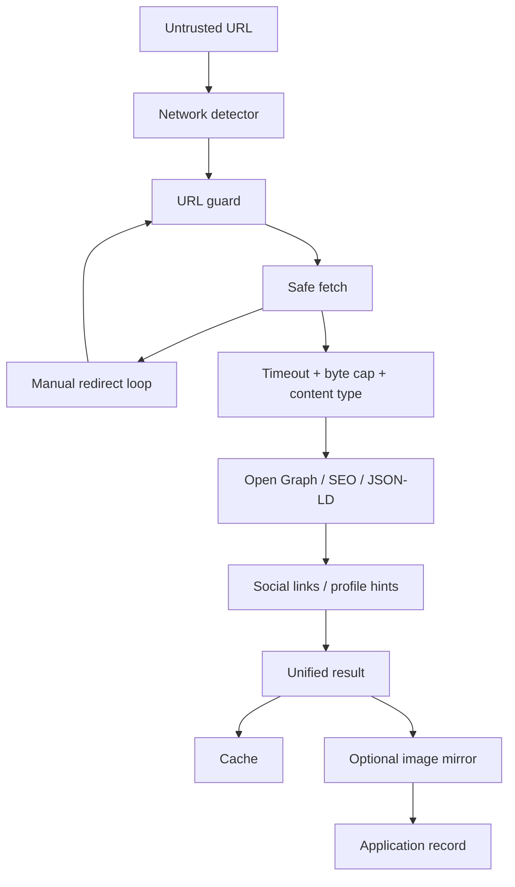

# Architecture

`url-metadata-social-fetcher` turns an untrusted public URL into useful application metadata while keeping outbound requests bounded.

## Priorities
1. Do not turn metadata enrichment into an SSRF primitive.
2. Bound time, bytes and redirects.
3. Degrade gracefully when third parties block or rate-limit.
4. Keep the core dependency-light and composable.
5. Expose small functions plus one high-level `enrichUrl()` API.

## Trust boundaries
Fetched metadata is untrusted. Sanitize before rendering, limit database field sizes, validate links before publishing and never interpret fetched strings as code or trusted moderation decisions.

## DNS rebinding
Hostname checks are not sufficient against every DNS-rebinding scenario. High-risk deployments should pair the package with egress/firewall/resolved-IP protections.

## Storage
`MirrorTarget` uses only `put()` and optional `get()`, so S3, R2, MinIO, filesystem and custom storage can be integrated without coupling the core to a vendor SDK.
